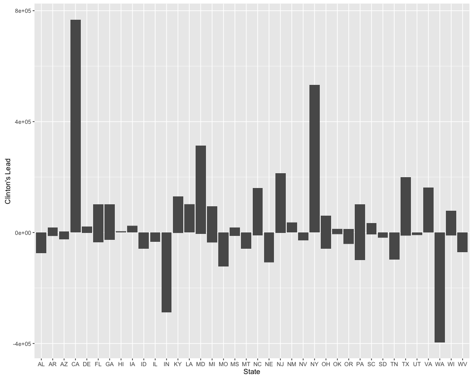
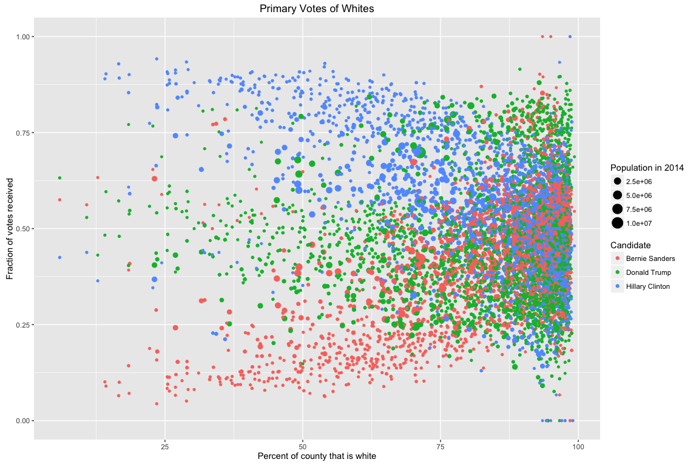
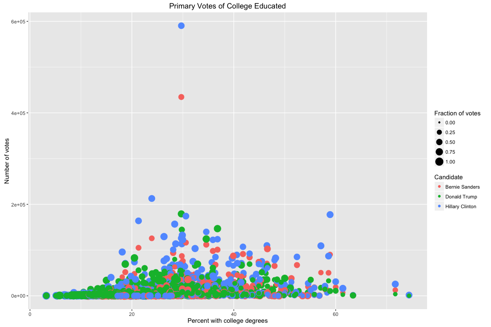
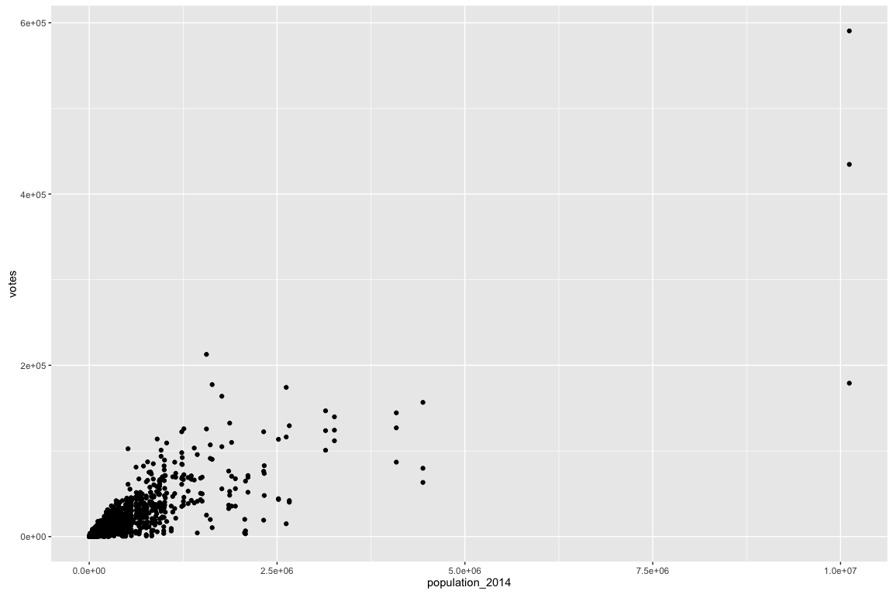
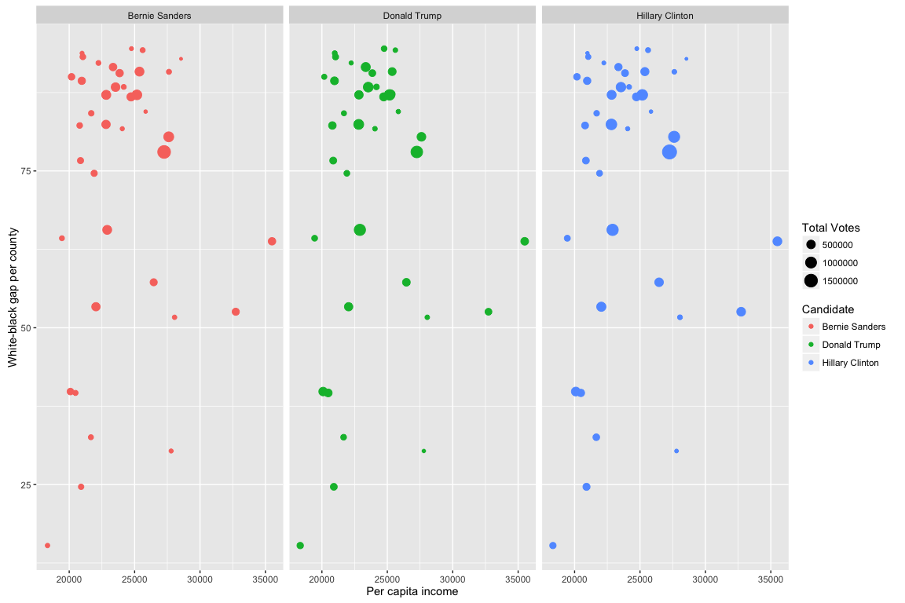

# Primary Analysis, Abridged
Amanda Dobbyn  


***

## Overview
* About:
    + This is a shortened version of `year_of_the_donald.Rmd` and `year_of_the_donald.R` that omits most of the code to focus on the models and graphs
    + Data from [Kaggle](https://www.kaggle.com/datasets) can be found in `county_facts_abr.csv` and `primary_results.csv`
* Load data:
    + With `readr::read_csv()` rather than from a local Postgres database (as in `year_of_the_donald.Rmd`) to switch things up 
* Join the two datasets by county code
* Analyze:
    + Group counties into states and from there get vote totals for general election candidates
    + Pretend that this is a head to head in the general: look at total number of votes cast for Clinton and Trump
    + Using an "all-or-nothing" scheme, calculate the "winner" of each county and each state
* Model
    + Use demographic variables to train a random forest algorithm that predicts which general election candidate will "win" each county. Calculate the importance of each of these variables to the predictive power of the model
    + Train a K-nearest neighbors algorithm to do the same
* Plot:
    + Plot Clinton's "lead" by state
    + Plot how various demographic variables affect vote outcomes for the candidates

***

1. Load in and prepare the two datasets


2. Join the datasets


3. Examine the first few rows of our main dataframe before doing any analysis on it

```r
kable(head(election), format="markdown")
```


| fips_county_code|state   |state_abbr |party    |candidate       | votes| fraction_votes|state_abbreviation | population_2014| female| white| black| hispanic| college| inc_percap| inc_household|
|----------------:|:-------|:----------|:--------|:---------------|-----:|--------------:|:------------------|---------------:|------:|-----:|-----:|--------:|-------:|----------:|-------------:|
|             1001|Alabama |AL         |Democrat |Bernie Sanders  |   544|          0.182|AL                 |           55395|   51.4|  77.9|  18.7|      2.7|    20.9|      24571|         53682|
|             1001|Alabama |AL         |Democrat |Hillary Clinton |  2387|          0.800|AL                 |           55395|   51.4|  77.9|  18.7|      2.7|    20.9|      24571|         53682|
|             1003|Alabama |AL         |Democrat |Bernie Sanders  |  2694|          0.329|AL                 |          200111|   51.2|  87.1|   9.6|      4.6|    27.7|      26766|         50221|
|             1003|Alabama |AL         |Democrat |Hillary Clinton |  5290|          0.647|AL                 |          200111|   51.2|  87.1|   9.6|      4.6|    27.7|      26766|         50221|
|             1005|Alabama |AL         |Democrat |Bernie Sanders  |   222|          0.078|AL                 |           26887|   46.6|  50.2|  47.6|      4.5|    13.4|      16829|         32911|
|             1005|Alabama |AL         |Democrat |Hillary Clinton |  2567|          0.906|AL                 |           26887|   46.6|  50.2|  47.6|      4.5|    13.4|      16829|         32911|

***

For exploratory analysis, see `year_of_the_donald.Rmd`

***
## Table of total votes in the primaries per candidate


Summarise various metrics by state and order by total number of votes received, descending 

```r
election.by.state <- election %>%
  group_by(state_abbreviation, candidate) %>%
  summarise(                 
    w.b_gap = mean(white - black),            
    fr.votes = mean(fraction_votes),
    tot.votes = sum(votes),
    percap = mean(inc_percap)
  ) %>%
  ungroup %>%
  arrange(desc(
    tot.votes
  ))
```


```r
election.by.state_rename <- election.by.state %>% 
  rename(
    State = state_abbreviation,
    Candidate = candidate,
    `White-Black Gap` = w.b_gap,
    `Fraction of Votes` = fr.votes,
    `Total Votes` = tot.votes,
    `Average Income (per capita)` = percap
  )
```


Display the table of various metrics by state ordered by total number of votes

```r
kable(election.by.state_rename, format = "markdown", 
      caption = "Total votes per candidate per state")
```


|State |Candidate       | White-Black Gap| Fraction of Votes| Total Votes| Average Income (per capita)|
|:-----|:---------------|---------------:|-----------------:|-----------:|---------------------------:|
|CA    |Hillary Clinton |        78.02931|         0.5135862|     1940580|                    27255.28|
|CA    |Bernie Sanders  |        78.02931|         0.4716207|     1502043|                    27255.28|
|CA    |Donald Trump    |        78.02931|         0.7695000|     1174829|                    27255.28|
|FL    |Hillary Clinton |        65.60746|         0.5562239|     1097400|                    22904.43|
|FL    |Donald Trump    |        65.60746|         0.4927910|     1077221|                    22904.43|
|NY    |Hillary Clinton |        80.44355|         0.4536129|     1054083|                    27608.37|
|TX    |Hillary Clinton |        82.42244|         0.6349134|      935080|                    22813.81|
|PA    |Hillary Clinton |        87.13134|         0.5016866|      918689|                    25173.30|
|PA    |Donald Trump    |        87.13134|         0.6068209|      892702|                    25173.30|
|NY    |Bernie Sanders  |        80.44355|         0.5463871|      763469|                    27608.37|
|TX    |Donald Trump    |        82.42244|         0.2916417|      757618|                    22813.81|
|OH    |Donald Trump    |        88.36705|         0.3893182|      727585|                    23542.81|
|PA    |Bernie Sanders  |        87.13134|         0.4833582|      719955|                    25173.30|
|OH    |Hillary Clinton |        88.36705|         0.5307955|      679266|                    23542.81|
|NC    |Hillary Clinton |        53.35000|         0.5360600|      616383|                    22042.28|
|MI    |Bernie Sanders  |        87.13373|         0.5548434|      595222|                    22830.25|
|IN    |Donald Trump    |        91.56630|         0.5657065|      590460|                    23351.16|
|MI    |Hillary Clinton |        87.13373|         0.4209518|      576795|                    22830.25|
|WI    |Bernie Sanders  |        90.84306|         0.5751528|      567936|                    25372.03|
|FL    |Bernie Sanders  |        65.60746|         0.3834179|      566603|                    22904.43|
|NJ    |Hillary Clinton |        63.78571|         0.6000000|      554237|                    35503.71|
|GA    |Hillary Clinton |        39.82893|         0.7351824|      543008|                    20093.77|
|MD    |Hillary Clinton |        52.55417|         0.5607500|      533247|                    32732.46|
|NY    |Donald Trump    |        80.44355|         0.5661774|      524932|                    27608.37|
|OH    |Bernie Sanders  |        88.36705|         0.4536023|      513549|                    23542.81|
|VA    |Hillary Clinton |        57.25113|         0.6384211|      503358|                    26457.60|
|GA    |Donald Trump    |        39.82893|         0.4671447|      501707|                    20093.77|
|MI    |Donald Trump    |        87.13373|         0.3974458|      483751|                    22830.25|
|TX    |Bernie Sanders  |        82.42244|         0.3242598|      475561|                    22813.81|
|NC    |Bernie Sanders  |        53.35000|         0.3886300|      460316|                    22042.28|
|NC    |Donald Trump    |        53.35000|         0.4466700|      458151|                    22042.28|
|IL    |Bernie Sanders  |        86.81584|         0.5240495|      452006|                    24727.96|
|WI    |Hillary Clinton |        90.84306|         0.4200417|      432767|                    25372.03|
|IL    |Donald Trump    |        86.81584|         0.4135941|      427086|                    24727.96|
|WA    |Donald Trump    |        87.25128|         0.7802308|      403003|                    25290.15|
|IL    |Hillary Clinton |        86.81584|         0.4560000|      396004|                    24727.96|
|WI    |Donald Trump    |        90.84306|         0.4314722|      386370|                    25372.03|
|MO    |Donald Trump    |        89.37130|         0.4572000|      382093|                    20960.84|
|AL    |Donald Trump    |        39.60896|         0.4868657|      371735|                    20481.43|
|NJ    |Donald Trump    |        63.78571|         0.7965238|      356697|                    35503.71|
|VA    |Donald Trump    |        57.25113|         0.4091278|      355960|                    26457.60|
|IN    |Bernie Sanders  |        91.56630|         0.5378696|      335256|                    23351.16|
|TN    |Donald Trump    |        82.24947|         0.4598632|      332702|                    20801.06|
|NJ    |Bernie Sanders  |        63.78571|         0.4000000|      323259|                    35503.71|
|OR    |Bernie Sanders  |        90.59722|         0.5634167|      320746|                    23853.67|
|MO    |Hillary Clinton |        89.37130|         0.4805217|      310602|                    20960.84|
|AL    |Hillary Clinton |        39.60896|         0.7612687|      309928|                    20481.43|
|MO    |Bernie Sanders  |        89.37130|         0.4984957|      309071|                    20960.84|
|IN    |Hillary Clinton |        91.56630|         0.4621304|      303382|                    23351.16|
|MD    |Bernie Sanders  |        52.55417|         0.3747083|      281275|                    32732.46|
|VA    |Bernie Sanders  |        57.25113|         0.3552556|      275507|                    26457.60|
|SC    |Hillary Clinton |        24.64130|         0.7853261|      271514|                    20910.52|
|OR    |Hillary Clinton |        90.59722|         0.4365833|      251739|                    23853.67|
|AZ    |Donald Trump    |        76.65333|         0.4890667|      249916|                    20863.93|
|TN    |Hillary Clinton |        82.24947|         0.6377684|      245304|                    20801.06|
|OR    |Donald Trump    |        90.59722|         0.6944444|      240804|                    23853.67|
|SC    |Donald Trump    |        24.64130|         0.3616957|      239851|                    20910.52|
|MD    |Donald Trump    |        52.55417|         0.5784583|      236623|                    32732.46|
|AZ    |Hillary Clinton |        76.65333|         0.5717333|      235697|                    20863.93|
|LA    |Hillary Clinton |        32.54531|         0.6724844|      221615|                    21658.66|
|GA    |Bernie Sanders  |        39.82893|         0.2519371|      214332|                    20093.77|
|KY    |Hillary Clinton |        90.01250|         0.4211500|      212550|                    20179.03|
|KY    |Bernie Sanders  |        90.01250|         0.4880083|      210626|                    20179.03|
|MS    |Donald Trump    |        15.27683|         0.5030000|      191755|                    18341.73|
|MS    |Hillary Clinton |        15.27683|         0.8278659|      182447|                    18341.73|
|OK    |Bernie Sanders  |        74.62597|         0.5391818|      174054|                    21907.58|
|AZ    |Bernie Sanders  |        76.65333|         0.3851333|      163400|                    20863.93|
|WV    |Donald Trump    |        93.18909|         0.7914909|      156245|                    21043.82|
|AR    |Hillary Clinton |        64.27333|         0.6397733|      144580|                    19443.19|
|OK    |Hillary Clinton |        74.62597|         0.3451818|      139338|                    21907.58|
|AR    |Donald Trump    |        64.27333|         0.3744667|      133144|                    19443.19|
|OK    |Donald Trump    |        74.62597|         0.3146104|      130141|                    21907.58|
|LA    |Donald Trump    |        32.54531|         0.4406719|      124818|                    21658.66|
|WV    |Bernie Sanders  |        93.18909|         0.5246000|      123860|                    21043.82|
|NE    |Donald Trump    |        94.50000|         0.6474409|      121287|                    24756.12|
|TN    |Bernie Sanders  |        82.24947|         0.3346000|      120333|                    20801.06|
|MT    |Donald Trump    |        88.40000|         0.7566607|      114056|                    24169.70|
|NM    |Hillary Clinton |        84.19697|         0.5198485|      110451|                    21684.76|
|NM    |Bernie Sanders  |        84.19697|         0.4801818|      103856|                    21684.76|
|SC    |Bernie Sanders  |        24.64130|         0.2078478|       95977|                    20910.52|
|WV    |Hillary Clinton |        93.18909|         0.3378000|       86354|                    21043.82|
|KY    |Donald Trump    |        90.01250|         0.3998833|       82493|                    20179.03|
|AL    |Bernie Sanders  |        39.60896|         0.1927313|       76399|                    20481.43|
|NM    |Donald Trump    |        84.19697|         0.7065758|       73530|                    21684.76|
|LA    |Bernie Sanders  |        32.54531|         0.2324531|       72240|                    21658.66|
|CO    |Bernie Sanders  |        90.80781|         0.5659688|       71928|                    27625.89|
|IA    |Hillary Clinton |        94.26263|         0.5187374|       69733|                    25615.56|
|IA    |Bernie Sanders  |        94.26263|         0.4725152|       69452|                    25615.56|
|AR    |Bernie Sanders  |        64.27333|         0.2901733|       64868|                    19443.19|
|MT    |Bernie Sanders  |        88.40000|         0.4852500|       63168|                    24169.70|
|ID    |Donald Trump    |        93.77500|         0.3085909|       62478|                    20982.14|
|UT    |Bernie Sanders  |        92.22069|         0.6667241|       61333|                    22237.24|
|DE    |Hillary Clinton |        51.66667|         0.5990000|       55950|                    28055.00|
|MT    |Hillary Clinton |        88.40000|         0.4531607|       55194|                    24169.70|
|CO    |Hillary Clinton |        90.80781|         0.3960625|       49256|                    27625.89|
|IA    |Donald Trump    |        94.26263|         0.2687172|       45419|                    25615.56|
|SD    |Donald Trump    |        81.73182|         0.6864697|       44866|                    24056.05|
|DE    |Donald Trump    |        51.66667|         0.6246667|       42472|                    28055.00|
|DE    |Bernie Sanders  |        51.66667|         0.3866667|       36659|                    28055.00|
|MS    |Bernie Sanders  |        15.27683|         0.1593537|       36348|                    18341.73|
|NV    |Donald Trump    |        84.46471|         0.4298235|       34531|                    25841.82|
|SD    |Hillary Clinton |        81.73182|         0.5030758|       27046|                    24056.05|
|SD    |Bernie Sanders  |        81.73182|         0.4969242|       25958|                    24056.05|
|UT    |Donald Trump    |        92.22069|         0.2047586|       24864|                    22237.24|
|HI    |Bernie Sanders  |        30.35000|         0.7397500|       23531|                    27792.75|
|WA    |Bernie Sanders  |        87.25128|         0.7612308|       19159|                    25290.15|
|NE    |Bernie Sanders  |        94.50000|         0.4922043|       19120|                    24756.12|
|ID    |Bernie Sanders  |        93.77500|         0.7114318|       18640|                    20982.14|
|UT    |Hillary Clinton |        92.22069|         0.2094828|       15666|                    22237.24|
|NE    |Hillary Clinton |        94.50000|         0.4863118|       14340|                    24756.12|
|HI    |Hillary Clinton |        30.35000|         0.2585000|       10127|                    27792.75|
|WA    |Hillary Clinton |        87.25128|         0.2361538|        7140|                    25290.15|
|NV    |Hillary Clinton |        84.46471|         0.4555882|        6296|                    25841.82|
|HI    |Donald Trump    |        30.35000|         0.4450000|        5677|                    27792.75|
|NV    |Bernie Sanders  |        84.46471|         0.5415294|        5641|                    25841.82|
|ID    |Hillary Clinton |        93.77500|         0.2782727|        5065|                    20982.14|
|WY    |Bernie Sanders  |        92.87826|         0.5601739|         156|                    28546.30|
|WY    |Hillary Clinton |        92.87826|         0.4398261|         124|                    28546.30|

Spread this table to wider format, making each candidate a variable whose value is the total number of votes he or she received

```r
election.by.state.spread <- election.by.state %>% 
  select (
    state_abbreviation, candidate, tot.votes
  ) %>%
  rename(
    State = state_abbreviation
  ) %>% 
  group_by(candidate) %>%
  spread (                  
    key = candidate,
    value = tot.votes
  ) 
```


```r
kable(election.by.state.spread, format = "markdown", 
      caption = "Total votes per candidate per state")
```


|State | Bernie Sanders| Donald Trump| Hillary Clinton|
|:-----|--------------:|------------:|---------------:|
|AL    |          76399|       371735|          309928|
|AR    |          64868|       133144|          144580|
|AZ    |         163400|       249916|          235697|
|CA    |        1502043|      1174829|         1940580|
|CO    |          71928|           NA|           49256|
|DE    |          36659|        42472|           55950|
|FL    |         566603|      1077221|         1097400|
|GA    |         214332|       501707|          543008|
|HI    |          23531|         5677|           10127|
|IA    |          69452|        45419|           69733|
|ID    |          18640|        62478|            5065|
|IL    |         452006|       427086|          396004|
|IN    |         335256|       590460|          303382|
|KY    |         210626|        82493|          212550|
|LA    |          72240|       124818|          221615|
|MD    |         281275|       236623|          533247|
|MI    |         595222|       483751|          576795|
|MO    |         309071|       382093|          310602|
|MS    |          36348|       191755|          182447|
|MT    |          63168|       114056|           55194|
|NC    |         460316|       458151|          616383|
|NE    |          19120|       121287|           14340|
|NJ    |         323259|       356697|          554237|
|NM    |         103856|        73530|          110451|
|NV    |           5641|        34531|            6296|
|NY    |         763469|       524932|         1054083|
|OH    |         513549|       727585|          679266|
|OK    |         174054|       130141|          139338|
|OR    |         320746|       240804|          251739|
|PA    |         719955|       892702|          918689|
|SC    |          95977|       239851|          271514|
|SD    |          25958|        44866|           27046|
|TN    |         120333|       332702|          245304|
|TX    |         475561|       757618|          935080|
|UT    |          61333|        24864|           15666|
|VA    |         275507|       355960|          503358|
|WA    |          19159|       403003|            7140|
|WI    |         567936|       386370|          432767|
|WV    |         123860|       156245|           86354|
|WY    |            156|           NA|             124|

***

<br><br>

## Models


#### Regression models


First a linear regression with only fixed effects.  
Percent female, percent college, and per capita income
predicting whether the winner of that county is Trump or Clinton.  

<br>

Clinton coded as 1, Trump as 0.

```r
simp_reg <- glm(winner ~ female + college + inc_percap,
                data=winner.winner, family=binomial())
kable(tidy(simp_reg), format="markdown")
```


|term        |   estimate| std.error|  statistic|  p.value|
|:-----------|----------:|---------:|----------:|--------:|
|(Intercept) |  4.9841552| 1.1697130|   4.261007| 2.04e-05|
|female      | -0.1060329| 0.0232929|  -4.552149| 5.30e-06|
|college     | -0.0901755| 0.0084775| -10.637067| 0.00e+00|
|inc_percap  |  0.0001298| 0.0000138|   9.375148| 0.00e+00|
This model suggests that women and college-educated people prefer Clinton, whereas Trump does better in wealthier counties.

<br>

Now a mixed model with percent female, percent college, and percent black
predicting winner.
Random intercept for state.

```r
mixed.mod <- winner.winner %>% 
  do(tidy(glmer(winner ~ female + college + black +
                  (1 | state_abbreviation),
                data=., family=binomial())))
kable(mixed.mod, format="markdown")
```


|term                              |   estimate| std.error|   statistic|   p.value|group              |
|:---------------------------------|----------:|---------:|-----------:|---------:|:------------------|
|(Intercept)                       |  5.5511598| 1.4328801|   3.8741272| 0.0001070|fixed              |
|female                            | -0.0204312| 0.0282795|  -0.7224733| 0.4700036|fixed              |
|college                           | -0.0733402| 0.0074884|  -9.7939035| 0.0000000|fixed              |
|black                             | -0.1550231| 0.0084682| -18.3065474| 0.0000000|fixed              |
|sd_(Intercept).state_abbreviation |  1.9742313|        NA|          NA|        NA|state_abbreviation |
Percent black is an important factor with counties with higher black populations more likely to support Clinton.

<br><br>

#### Random Forest


How important are each of the demographic variables?

```r
round(importance(win.rf), 2)
```

```
##                 Clinton Trump MeanDecreaseAccuracy MeanDecreaseGini
## population_2014   25.21 18.92                30.77           185.72
## female             0.97 16.60                14.97           128.53
## black             86.49 83.43               115.44           311.16
## hispanic          32.17 15.78                31.35           157.65
## college           26.35 27.46                41.75           161.50
## inc_percap        -6.20 45.93                41.98           170.10
```
Percent black seems to be particularly important  


<br><br>


#### K Nearest Neighbors


See how well the model did

```r
library(gmodels)
CrossTable(nov.test.labels, nov.pred, prop.chisq = F)
```

```
## 
##  
##    Cell Contents
## |-------------------------|
## |                       N |
## |           N / Row Total |
## |           N / Col Total |
## |         N / Table Total |
## |-------------------------|
## 
##  
## Total Observations in Table:  1798 
## 
##  
##                 | nov.pred 
## nov.test.labels |   Clinton |     Trump | Row Total | 
## ----------------|-----------|-----------|-----------|
##         Clinton |       262 |       264 |       526 | 
##                 |     0.498 |     0.502 |     0.293 | 
##                 |     0.642 |     0.190 |           | 
##                 |     0.146 |     0.147 |           | 
## ----------------|-----------|-----------|-----------|
##           Trump |       146 |      1126 |      1272 | 
##                 |     0.115 |     0.885 |     0.707 | 
##                 |     0.358 |     0.810 |           | 
##                 |     0.081 |     0.626 |           | 
## ----------------|-----------|-----------|-----------|
##    Column Total |       408 |      1390 |      1798 | 
##                 |     0.227 |     0.773 |           | 
## ----------------|-----------|-----------|-----------|
## 
## 
```
The algorithm classifies Trump better than Clinton, maybe because he won more overall counties(more data -> better prediction)


***

<br><br>


# Plots


Bar graphs for each state plotting whether Clinton won or lost in a fake head-to-head with Trump

```r
clinton.lead.plot <- ggplot(winner.winner) +
  geom_bar(aes(x=state_abbreviation, y=clinton.lead), stat='identity') +
  xlab("State") +
  ylab("Clinton's Lead")

clinton.lead.plot
```

<!-- -->

<br>

For each county, plot fraction of votes received against percent white for each candidate

```r
white.plot <- ggplot(election, aes(white, fraction_votes))
white.plot + geom_point(aes(colour = candidate, size=population_2014)) +
  labs(title = "Primary Votes of Whites") +
  xlab("Percent of county that is white") +
  ylab("Fraction of votes received") +
  labs(colour = "Candidate", size = "Population in 2014")
```

<!-- -->
So at low percent white (left half of graph), Hillary does best and Bernie does worst at high percent white it's more of a jumble  

Size of point as fraction of vote

```r
college.plot <- ggplot(election, aes(college, votes))
college.plot + geom_point(aes(colour = candidate, size=fraction_votes)) +
  labs(title = "Primary Votes of College Educated") +
  xlab("Percent with college degrees") +
  ylab("Number of votes") +
  labs(colour = "Candidate", size = "Fraction of votes")
```

<!-- -->

What's up with outlier county with very high population?  
Plot population per county against votes cast per county

```r
qplot(population_2014, votes, data = election)
```

<!-- -->

Looks like there's also a county that cast a lot of votes  
Find county with highest population

```r
election[which.max(election$population_2014), 
         c("fips_county_code", "state", "population_2014")]
```

```
## # A tibble: 1 × 3
##   fips_county_code      state population_2014
##              <int>     <fctr>           <dbl>
## 1             6037 California        10116705
```
So the outlier is FIPS code 6037 (LA county).  
According to Google, they are the county with the highest population in the US (9,818,605).
Second is Cook County, IL at 5,194,675 (woot)  

<br>


Graph per capita income, the white-black gap, and total votes by state
for all three candidates

```r
by.state.plot <- ggplot(election.by.state, aes(percap, w.b_gap))
by.state.plot + geom_point(aes(colour = candidate, size=tot.votes)) +
  facet_grid(. ~ candidate) +
  xlab("Per capita income") +
  ylab("White-black gap per county") +
  labs(size="Total Votes", colour = "Candidate")
```

<!-- -->


