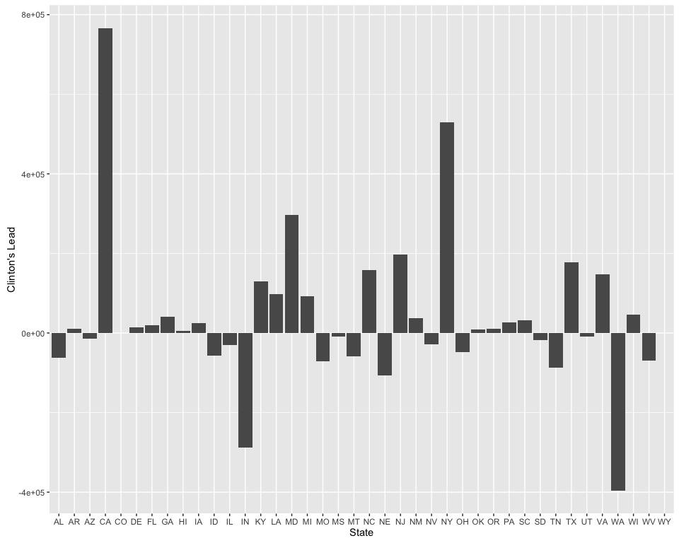

# 2016 Primary Analysis
Amanda Dobbyn  
September 24, 2016  

***

# Overview
* About:
    + Data from [Kaggle](https://www.kaggle.com/datasets) can be found in `county_facts_abr.csv` and `primary_results.csv` and loaded in with whatever flavor of `read.csv` you prefer. Then you can pare down to the candidates treated here with `dplyr::filter()` or the base R alternative
    + More extensive code in `year_of_the_donald.R`
* Load data:
    + From a local PostgreSQL database
* Join the two datasets by county code
* Analyze:
    + Group counties into states and from there get vote totals/averages for candidates of interest
    + Pretend that this is a head to head in the general: look at total number of votes cast for Clinton and Trump
    + Using an "all-or-nothing" scheme, calculate the "winner" of each county and each state
* Model
    + Use demographic variables to train a random forest algorithm that predicts which general election candidate will "win" each county. Calculate the importance of each of these variables to the predictive power of the model
    + Train a K-nearest neighbors algorithm to do the same
* Plot:
    + Plot Clinton's "lead" by state
    + Plot how various demographic variables affect vote outcomes for the candidates

***

# Load in and join datasets

Load in packages

```r
library(knitr)
library(RPostgreSQL)
library(tibble)
library(tidyr)
library(dplyr)   # remember that MASS::select will mask dplyr::select, so detach MASS or use dplyr::select
```

### Set up PostgreSQL connection
Read in 2016 presidential primary data from SQL database

```r
# set up driver as postgres
drv <- dbDriver("PostgreSQL")

# set connection to our db
con <- dbConnect(drv, dbname="pullplay_db", host='localhost', port=5432, user="amanda")

# select all variables for the candidates Bernie, Trump, and Hillary
primary_2016 <- dbGetQuery(con, "SELECT * FROM primary_2016
                           WHERE candidate in ('Bernie Sanders', 'Donald Trump', 'Hillary Clinton')") 
```

### Manipulate variable types

Stick variables we want to make into factors in a vector

```r
to.factor <- c('state', 'state_abbr', 'county', 'party',
               'candidate')

# use apply to make those variables factors
primary_2016[, to.factor] <- data.frame(apply(primary_2016[, to.factor], 2, as.factor))

# make votes numeric so we can do math on them
primary_2016$votes <- as.numeric(primary_2016$votes)
```

Print structure and first few rows of the dataframe

```r
str(primary_2016)
```

```r
head(primary_2016)
```

```
##   id   state state_abbr  county fips_county_code    party       candidate
## 1  1 Alabama         AL Autauga             1001 Democrat  Bernie Sanders
## 2  2 Alabama         AL Autauga             1001 Democrat Hillary Clinton
## 3  3 Alabama         AL Baldwin             1003 Democrat  Bernie Sanders
## 4  4 Alabama         AL Baldwin             1003 Democrat Hillary Clinton
## 5  5 Alabama         AL Barbour             1005 Democrat  Bernie Sanders
## 6  6 Alabama         AL Barbour             1005 Democrat Hillary Clinton
##   votes fraction_votes
## 1   544          0.182
## 2  2387          0.800
## 3  2694          0.329
## 4  5290          0.647
## 5   222          0.078
## 6  2567          0.906
```

Make primary df into a tibble

```r
primary_2016 <- as_tibble(primary_2016)
```


Import county facts data

```r
# read in county_facts data from database
county_facts <- dbGetQuery(con, "SELECT * FROM county_facts")
```

Prepare like primary data

```r
to.fact <- c('area_name', 'state_abbreviation')
county_facts[, to.fact] <- data.frame(apply(county_facts[, to.fact], 2, as.factor))
county_facts <- as_tibble(county_facts)
```

Take a look

```r
str(county_facts)
```


```r
head(county_facts)
```

```
## # A tibble: 6 × 12
##      id county_code      area_name state_abbreviation population_2014
##   <int>       <int>         <fctr>             <fctr>           <int>
## 1     1           0  United States                 NA       318857056
## 2     2        1000        Alabama                 NA         4849377
## 3     3        1001 Autauga County                 AL           55395
## 4     4        1003 Baldwin County                 AL          200111
## 5     5        1005 Barbour County                 AL           26887
## 6     6        1007    Bibb County                 AL           22506
## # ... with 7 more variables: female <dbl>, white <dbl>, black <dbl>,
## #   hispanic <dbl>, college <dbl>, inc_percap <dbl>, inc_household <dbl>
```

### Join datasets


```r
# take id out of county_facts so join() doesn't join on id
county <- county_facts %>%
  select (
    county_code,
    state_abbreviation, population_2014,               
    female, white, black, hispanic, college,
    inc_percap, inc_household
  )

# inner join with primary data on county code to get our main dataset
election <- primary_2016 %>%
  select(
    fips_county_code,           
    state, state_abbr, 
    party, candidate,
    votes, fraction_votes
  ) %>%
  inner_join(county, by = c("fips_county_code" = "county_code"))
```

Make election a tibble

```r
election <- as_tibble(election)
```

Examine our main dataframe

```r
str(election)
```


```r
head(election)
```

```
## # A tibble: 6 × 16
##   fips_county_code   state state_abbr    party       candidate votes
##              <dbl>  <fctr>     <fctr>   <fctr>          <fctr> <dbl>
## 1             1001 Alabama         AL Democrat  Bernie Sanders   544
## 2             1001 Alabama         AL Democrat Hillary Clinton  2387
## 3             1003 Alabama         AL Democrat  Bernie Sanders  2694
## 4             1003 Alabama         AL Democrat Hillary Clinton  5290
## 5             1005 Alabama         AL Democrat  Bernie Sanders   222
## 6             1005 Alabama         AL Democrat Hillary Clinton  2567
## # ... with 10 more variables: fraction_votes <dbl>,
## #   state_abbreviation <fctr>, population_2014 <int>, female <dbl>,
## #   white <dbl>, black <dbl>, hispanic <dbl>, college <dbl>,
## #   inc_percap <dbl>, inc_household <dbl>
```


```r
# make population and votes numeric 
election$population_2014 <- as.numeric(election$population_2014)
election$votes <- as.numeric(election$votes)
```

51 levels of state_abbreviation (from county_facts data) and 49 levels state_abbr (from primary_2016 data)  

See what the 2 level difference is

```r
setdiff(levels(election$state_abbreviation), levels(election$state_abbr))
```

```
## [1] "DC" "MN"
```
So we don't have primary_2016 data from DC and MN


### Manipulate election tibble to get a sense of the data


Make a window function to calculate state-wide averages per candidate
while keeping county-wide counts as well


```r
e.window <- election %>%
  filter (
    candidate %in% c('Hillary Clinton', 'Donald Trump')
  ) %>%
  group_by(state_abbreviation, candidate) %>%
  mutate(                 
    n.counties = n(),
    w.b_gap = (white - black),        
    state.fr.votes = mean(fraction_votes),
    state.percap = mean(inc_percap)
  ) %>%
  select (
    state_abbreviation, votes, fraction_votes, w.b_gap,       # these are county-wide
    n.counties, state.fr.votes, state.percap                  # these are state-wide
  ) %>%
  print(n = 10)
```


Get average votes per county per state (i.e., collapse across county)  
First, only look at Bernie and Hillary

```r
dems <- election %>%
  na.omit() %>%
  group_by(state, candidate) %>%
  filter(candidate %in% c('Bernie Sanders', 'Hillary Clinton')) %>%
  select(candidate, state, votes, fraction_votes) %>%
  summarise(
    avg_votes = mean(votes)
  ) 
```


Unstack the candidates

```r
dems.spread <- dems %>%
  spread (
    key = candidate,
    value = avg_votes
  )
kable(dems.spread, format = "markdown")
```


|state          | Bernie Sanders| Hillary Clinton|
|:--------------|--------------:|---------------:|
|Alabama        |    1140.283582|     4625.791045|
|Arizona        |   10893.333333|    15713.133333|
|Arkansas       |     864.906667|     1927.733333|
|California     |   25897.293103|    33458.275862|
|Colorado       |    1123.875000|      769.625000|
|Delaware       |   12219.666667|    18650.000000|
|Florida        |    8456.761194|    16379.104478|
|Georgia        |    1348.000000|     3415.144654|
|Hawaii         |    5882.750000|     2531.750000|
|Idaho          |     423.636364|      115.113636|
|Illinois       |    4475.306931|     3920.831683|
|Indiana        |    3644.086956|     3297.630435|
|Iowa           |     701.535354|      704.373737|
|Kentucky       |    1755.216667|     1771.250000|
|Louisiana      |    1128.750000|     3462.734375|
|Maryland       |   11719.791667|    22218.625000|
|Michigan       |    7171.349398|     6949.337349|
|Mississippi    |     443.268293|     2224.963415|
|Missouri       |    2687.573913|     2700.886956|
|Montana        |    1128.000000|      985.607143|
|Nebraska       |     205.591398|      154.193548|
|Nevada         |     331.823529|      370.352941|
|New Jersey     |   15393.285714|    26392.238095|
|New Mexico     |    3147.151515|     3347.000000|
|New York       |   12314.016129|    17001.338710|
|North Carolina |    4603.160000|     6163.830000|
|Ohio           |    5835.784091|     7718.931818|
|Oklahoma       |    2260.441558|     1809.584416|
|Oregon         |    8909.611111|     6992.750000|
|Pennsylvania   |   10745.597015|    13711.776119|
|South Carolina |    2086.456522|     5902.478261|
|South Dakota   |     393.303030|      409.787879|
|Tennessee      |    1266.663158|     2582.147368|
|Texas          |    1872.287402|     3681.417323|
|Utah           |    2114.931034|      540.206897|
|Virginia       |    2071.481203|     3784.646617|
|Washington     |     491.256410|      183.076923|
|West Virginia  |    2252.000000|     1570.072727|
|Wisconsin      |    7888.000000|     6010.652778|
|Wyoming        |       6.782609|        5.391304|

Get fraction of votes per candidate per state weighted by state population  
Limit to general election candidates

```r
general.by.state <- election %>%
  filter (
    candidate %in% c('Hillary Clinton', 'Donald Trump')
  ) %>%
  group_by(state_abbreviation, candidate) %>%
  select (
    state_abbreviation, votes,
    candidate, population_2014
  ) %>%
  summarise (
    tot.votes = sum(votes),
    mean.by.state = mean(votes),
    pop = sum(population_2014)
    # weight.votes = (mean.by.state*pop)
  ) %>%
  ungroup %>%
  arrange(desc(
    pop), desc(tot.votes)
  ) 
```

Spread total votes per candidate per state

```r
general.by.state.spread <- general.by.state %>%
  select(
    state_abbreviation, candidate, tot.votes
  ) %>%
  spread (                  
    key = candidate,
    value = tot.votes     # so the value under each candidate's name is the total number of votes they received
  ) 
```

Rename columns to candidates' last names

```r
names(general.by.state.spread)[names(general.by.state.spread)=='Donald Trump'] <- 'Trump'
names(general.by.state.spread)[names(general.by.state.spread)=='Hillary Clinton'] <- 'Clinton'
```


```r
kable(general.by.state.spread, format = "markdown")
```


|state_abbreviation |   Trump| Clinton|
|:------------------|-------:|-------:|
|AL                 |  371735|  309928|
|AR                 |  133144|  144580|
|AZ                 |  249916|  235697|
|CA                 | 1174829| 1940580|
|CO                 |      NA|   49256|
|DE                 |   42472|   55950|
|FL                 | 1077221| 1097400|
|GA                 |  501707|  543008|
|HI                 |    5677|   10127|
|IA                 |   45419|   69733|
|ID                 |   62478|    5065|
|IL                 |  427086|  396004|
|IN                 |  590460|  303382|
|KY                 |   82493|  212550|
|LA                 |  124818|  221615|
|MD                 |  236623|  533247|
|MI                 |  483751|  576795|
|MO                 |  382093|  310602|
|MS                 |  191755|  182447|
|MT                 |  114056|   55194|
|NC                 |  458151|  616383|
|NE                 |  121287|   14340|
|NJ                 |  356697|  554237|
|NM                 |   73530|  110451|
|NV                 |   34531|    6296|
|NY                 |  524932| 1054083|
|OH                 |  727585|  679266|
|OK                 |  130141|  139338|
|OR                 |  240804|  251739|
|PA                 |  892702|  918689|
|SC                 |  239851|  271514|
|SD                 |   44866|   27046|
|TN                 |  332702|  245304|
|TX                 |  757618|  935080|
|UT                 |   24864|   15666|
|VA                 |  355960|  503358|
|WA                 |  403003|    7140|
|WI                 |  386370|  432767|
|WV                 |  156245|   86354|
|WY                 |      NA|     124|

### Mock head-to-head

Pretending that this is a head-to-head (and not totally different primaries), see how much Clinton is winning by in total votes cast per state


```r
clinton.lead <- general.by.state.spread %>%
  mutate(
    hil.lead = Clinton - Trump
  ) 
clinton.lead
```

#### Winner take all

Give the loser a 0 in total votes


```r
all.or.nothing <- clinton.lead %>%
  na.omit() %>%          # take out rows that contain NAs
  mutate (
    winner = ifelse(hil.lead > 0, 'Hil', 'Donald'),
    all.nothing.donald = ifelse(Trump > Clinton, Trump, 0),
    all.nothing.hillary = ifelse(Clinton > Trump, Clinton, 0)
  )
kable(all.or.nothing, format = "markdown")
```


|state_abbreviation |   Trump| Clinton| hil.lead|winner | all.nothing.donald| all.nothing.hillary|
|:------------------|-------:|-------:|--------:|:------|------------------:|-------------------:|
|AL                 |  371735|  309928|   -61807|Donald |             371735|                   0|
|AR                 |  133144|  144580|    11436|Hil    |                  0|              144580|
|AZ                 |  249916|  235697|   -14219|Donald |             249916|                   0|
|CA                 | 1174829| 1940580|   765751|Hil    |                  0|             1940580|
|DE                 |   42472|   55950|    13478|Hil    |                  0|               55950|
|FL                 | 1077221| 1097400|    20179|Hil    |                  0|             1097400|
|GA                 |  501707|  543008|    41301|Hil    |                  0|              543008|
|HI                 |    5677|   10127|     4450|Hil    |                  0|               10127|
|IA                 |   45419|   69733|    24314|Hil    |                  0|               69733|
|ID                 |   62478|    5065|   -57413|Donald |              62478|                   0|
|IL                 |  427086|  396004|   -31082|Donald |             427086|                   0|
|IN                 |  590460|  303382|  -287078|Donald |             590460|                   0|
|KY                 |   82493|  212550|   130057|Hil    |                  0|              212550|
|LA                 |  124818|  221615|    96797|Hil    |                  0|              221615|
|MD                 |  236623|  533247|   296624|Hil    |                  0|              533247|
|MI                 |  483751|  576795|    93044|Hil    |                  0|              576795|
|MO                 |  382093|  310602|   -71491|Donald |             382093|                   0|
|MS                 |  191755|  182447|    -9308|Donald |             191755|                   0|
|MT                 |  114056|   55194|   -58862|Donald |             114056|                   0|
|NC                 |  458151|  616383|   158232|Hil    |                  0|              616383|
|NE                 |  121287|   14340|  -106947|Donald |             121287|                   0|
|NJ                 |  356697|  554237|   197540|Hil    |                  0|              554237|
|NM                 |   73530|  110451|    36921|Hil    |                  0|              110451|
|NV                 |   34531|    6296|   -28235|Donald |              34531|                   0|
|NY                 |  524932| 1054083|   529151|Hil    |                  0|             1054083|
|OH                 |  727585|  679266|   -48319|Donald |             727585|                   0|
|OK                 |  130141|  139338|     9197|Hil    |                  0|              139338|
|OR                 |  240804|  251739|    10935|Hil    |                  0|              251739|
|PA                 |  892702|  918689|    25987|Hil    |                  0|              918689|
|SC                 |  239851|  271514|    31663|Hil    |                  0|              271514|
|SD                 |   44866|   27046|   -17820|Donald |              44866|                   0|
|TN                 |  332702|  245304|   -87398|Donald |             332702|                   0|
|TX                 |  757618|  935080|   177462|Hil    |                  0|              935080|
|UT                 |   24864|   15666|    -9198|Donald |              24864|                   0|
|VA                 |  355960|  503358|   147398|Hil    |                  0|              503358|
|WA                 |  403003|    7140|  -395863|Donald |             403003|                   0|
|WI                 |  386370|  432767|    46397|Hil    |                  0|              432767|
|WV                 |  156245|   86354|   -69891|Donald |             156245|                   0|

How many states did each win?

```r
length(which(all.or.nothing$winner=='Hil')) # 22
```

```
## [1] 22
```

```r
length(which(all.or.nothing$winner=='Donald')) # 16
```

```
## [1] 16
```

How many overall votes did Clinton win by?

```r
all.or.nothing.sums <- all.or.nothing %>%
  ungroup %>%
  summarise (
    sum.d = sum(all.nothing.donald),
    sum.hil = sum(all.nothing.hillary),
    diff = sum.hil - sum.d
  )
kable(all.or.nothing.sums, format = "markdown")
```


|   sum.d|  sum.hil|    diff|
|-------:|--------:|-------:|
| 4234662| 11193224| 6958562|


# The meat of the analysis

Make our main tibble that has both our winner column and demographic data  

Limit to general election candidates


```r
combo <- election %>%
  dplyr::filter (
    candidate %in% c('Hillary Clinton', 'Donald Trump')
  ) %>%
  droplevels() %>%
  select (
    state_abbreviation, votes, fips_county_code,
    candidate, population_2014,
    female, white, black, hispanic, college, inc_percap
  ) 
combo
```

Check that our only levels are Hillary and Donald

```r
levels(combo$candidate)
```

```
## [1] "Donald Trump"    "Hillary Clinton"
```


```r
# spread out by candidate
combo.spread <- combo %>%
  spread (                  
    key = candidate,
    value = votes
  ) 
combo.spread
```
Rename columns and take a look

```r
combo.spread <- combo.spread %>%
  rename(
    Trump = `Donald Trump`,
    Clinton = `Hillary Clinton`
  )

# check out Trump and Clinton columns
combo.spread[, -3]
```


Add Hillary's lead, all or nothing, and winner columns

```r
winner.winner <- combo.spread %>%
  na.omit() %>%                         # take out all NAs
  mutate(
    hil.lead = Clinton - Trump,
    winner = ifelse(hil.lead > 0, 'Hil', 'Donald'),
    all.nothing.donald = ifelse(Trump > Clinton, Trump, 0),
    all.nothing.hillary = ifelse(Clinton > Trump, Clinton, 0)
  ) 
```

Make the winner column a factor

```r
winner.winner$winner <- factor(winner.winner$winner)
```

See who got the chicken dinner for each county

```r
head(winner.winner[, c('state_abbreviation', 'fips_county_code', 'winner')])
```

```
## # A tibble: 6 × 3
##   state_abbreviation fips_county_code winner
##               <fctr>            <dbl> <fctr>
## 1                 AL             1001 Donald
## 2                 AL             1003 Donald
## 3                 AL             1005    Hil
## 4                 AL             1007 Donald
## 5                 AL             1009 Donald
## 6                 AL             1011    Hil
```


Make a combo for each state

```r
combo.by.state <- combo %>%
  group_by(state_abbreviation, candidate) %>%
  summarise (
    tot.votes = sum(votes),
    mean.votes = mean(votes),
    pop = sum(population_2014),
    mean.female = mean(female),
    mean.white = mean(white),
    mean.black = mean(black),
    mean.hisp = mean(hispanic),
    mean.inc = mean(inc_percap)
    #   mean.Trump = mean(Trump),      # consider making nice.Trump
    #   mean.Clinton = mean(Clinton)
  ) %>%
  arrange(desc(
    pop), desc(tot.votes)
  )
```


```r
str(combo.by.state)
```

Spread by total votes (can also do by mean.votes)

```r
combo.by.state.spread <- combo.by.state %>%
  select (
    state_abbreviation, candidate,
    tot.votes, # note that have to take out mean.votes or tot.votes so that don't get NAs in the Trump and Clinton columns
    pop, mean.female, mean.white, mean.black, mean.hisp, mean.inc
  ) %>%
  na.omit() %>%
  spread (                  
    key = candidate,
    value = tot.votes
  ) 
kable(combo.by.state.spread, format = "markdown")
```


|state_abbreviation |      pop| mean.female| mean.white| mean.black| mean.hisp| mean.inc| Donald Trump| Hillary Clinton|
|:------------------|--------:|-----------:|----------:|----------:|---------:|--------:|------------:|---------------:|
|CA                 | 38802500|    49.51724|   81.59483|  3.5655172| 29.846552| 27255.28|      1174829|         1940580|
|TX                 | 26956958|    49.19528|   89.24449|  6.8220472| 33.931102| 22813.81|       757618|          935080|
|FL                 | 19893297|    48.60000|   80.61045| 15.0029851| 13.461194| 22904.43|      1077221|         1097400|
|NY                 | 19746227|    50.21935|   87.42581|  6.9822581|  7.525806| 27608.37|       524932|         1054083|
|PA                 | 12787209|    50.02836|   91.98806|  4.8567164|  4.032836| 25173.30|       892702|          918689|
|OH                 | 11594163|    50.37841|   92.69773|  4.3306818|  2.552273| 23542.81|       727585|          679266|
|GA                 | 10097343|    50.30755|   68.19308| 28.3641509|  6.289937| 20093.77|       501707|          543008|
|NC                 |  9943964|    50.82000|   74.15100| 20.8010000|  7.017000| 22042.28|       458151|          616383|
|MI                 |  9909877|    49.66747|   91.18434|  4.0506024|  3.387952| 22830.25|       483751|          576795|
|NJ                 |  8938175|    51.06190|   76.97143| 13.1857143| 16.666667| 35503.71|       356697|          554237|
|VA                 |  8326289|    50.62857|   76.23459| 18.9834586|  5.112030| 26457.60|       355960|          503358|
|IL                 |  7634124|    49.91188|   91.92475|  5.1089109|  4.625743| 24727.96|       427086|          396004|
|WA                 |  7061530|    49.84615|   88.86667|  1.6153846| 13.810256| 25290.15|       403003|            7140|
|AZ                 |  6731484|    49.63333|   78.98667|  2.3333333| 30.620000| 20863.93|       249916|          235697|
|IN                 |  6596855|    50.19674|   94.41522|  2.8489130|  3.831522| 23351.16|       590460|          303382|
|TN                 |  6549352|    50.45789|   89.75158|  7.5021053|  3.350526| 20801.06|       332702|          245304|
|MO                 |  6063589|    50.10870|   93.08435|  3.7130435|  2.750435| 20960.84|       382093|          310602|
|MD                 |  5976407|    50.87917|   73.13750| 20.5833333|  5.683333| 32732.46|       236623|          533247|
|WI                 |  5757564|    49.64167|   92.55417|  1.7111111|  3.550000| 25372.03|       386370|          432767|
|CO                 |  5355866|    48.04531|   92.61875|  1.8109375| 19.612500| 27625.89|           NA|           49256|
|AL                 |  4849377|    51.26269|   68.26418| 28.6552239|  3.540299| 20481.43|       371735|          309928|
|SC                 |  4832482|    50.93261|   60.74565| 36.1043478|  4.463044| 20910.52|       239851|          271514|
|LA                 |  4649676|    49.94531|   64.62812| 32.0828125|  3.379688| 21658.66|       124818|          221615|
|KY                 |  4413457|    50.25250|   93.86917|  3.8566667|  2.330000| 20179.03|        82493|          212550|
|OR                 |  3970239|    50.04167|   91.48889|  0.8916667| 11.569444| 23853.67|       240804|          251739|
|OK                 |  3878051|    49.84416|   78.40519|  3.7792208|  8.603896| 21907.58|       130141|          139338|
|IA                 |  3107126|    50.15152|   95.68889|  1.4262626|  4.444444| 25615.56|        45419|           69733|
|MS                 |  2994079|    51.01220|   56.48537| 41.2085366|  2.426829| 18341.73|       191755|          182447|
|AR                 |  2966369|    50.54133|   80.40667| 16.1333333|  5.113333| 19443.19|       133144|          144580|
|UT                 |  2942902|    49.11724|   92.87586|  0.6551724|  8.886207| 22237.24|        24864|           15666|
|NV                 |  2839099|    47.41176|   87.34118|  2.8764706| 17.882353| 25841.82|        34531|            6296|
|NM                 |  2085572|    49.37273|   86.02424|  1.8272727| 47.018182| 21684.76|        73530|          110451|
|NE                 |  1881503|    49.81613|   95.42688|  0.9268817|  6.332258| 24756.12|       121287|           14340|
|WV                 |  1850326|    50.11455|   95.56727|  2.3781818|  1.250909| 21043.82|       156245|           86354|
|ID                 |  1634464|    49.26136|   94.35455|  0.5795455| 12.597727| 20982.14|        62478|            5065|
|HI                 |  1419472|    49.70000|   31.75000|  1.4000000| 10.900000| 27792.75|         5677|           10127|
|MT                 |  1023579|    49.16250|   88.80714|  0.4071429|  2.676786| 24169.70|       114056|           55194|
|DE                 |   935614|    51.63333|   72.63333| 20.9666667|  8.533333| 28055.00|        42472|           55950|
|SD                 |   853175|    49.47879|   82.51212|  0.7803030|  2.810606| 24056.05|        44866|           27046|
|WY                 |   584153|    49.03913|   94.04348|  1.1652174|  8.443478| 28546.30|           NA|             124|

Check the end of the column

```r
combo.by.state.spread[, c(1, 6:ncol(combo.by.state.spread))]
```

Rename columns

```r
combo.by.state.spread <- combo.by.state.spread %>%
  rename(
    Trump = `Donald Trump`,
    Clinton = `Hillary Clinton`
  )
```

Add winner stuff

```r
combo.by.state.spread <- combo.by.state.spread %>% 
  na.omit() %>%                         # take out all NAs
  mutate (
    hil.lead = Clinton - Trump,
    winner = ifelse(hil.lead > 0, 'Hil', 'Donald'),
    all.nothing.donald = ifelse(Trump > Clinton, Trump, 0),
    all.nothing.hillary = ifelse(Clinton > Trump, Clinton, 0)
  ) 
```

Make the winner column a factor


```r
combo.by.state.spread$winner <- factor(combo.by.state.spread$winner)
```

See who got the chicken dinner for each county

```r
head(combo.by.state.spread[, c('state_abbreviation', 'winner')])
```


## Models

### Mixed model regressions


```r
library(lme4)
```

```
## Loading required package: Matrix
```

```
## 
## Attaching package: 'Matrix'
```

```
## The following object is masked from 'package:tidyr':
## 
##     expand
```

```r
library(broom)
```

First a linear regression with only fixed effects.  
Percent female, percent college, and per capita income
predicting whether the winner of that county is Trump or Clinton.

```r
simp_reg <- glm(winner ~ female + college + inc_percap,
                data=winner.winner, family=binomial())
tidy(simp_reg)
```

```
##          term      estimate    std.error statistic      p.value
## 1 (Intercept) -4.9841551844 1.169713e+00 -4.261007 2.035078e-05
## 2      female  0.1060329419 2.329294e-02  4.552149 5.310078e-06
## 3     college  0.0901754919 8.477477e-03 10.637067 2.003359e-26
## 4  inc_percap -0.0001298248 1.384776e-05 -9.375148 6.907855e-21
```

Now a mixed model with percent female, percent college, and percent black
predicting winner.
Random intercept for state.

```r
mixed.mod <- winner.winner %>% 
  do(tidy(glmer(winner ~ female + college + black +
                  (1 | state_abbreviation),
                data=., family=binomial())))
mixed.mod
```

```
##                                term    estimate   std.error  statistic
## 1                       (Intercept) -5.55115591 1.432720375 -3.8745564
## 2                            female  0.02043102 0.028276606  0.7225414
## 3                           college  0.07334044 0.007488347  9.7939428
## 4                             black  0.15502298 0.008468168 18.3065547
## 5 sd_(Intercept).state_abbreviation  1.97424323          NA         NA
##        p.value              group
## 1 1.068191e-04              fixed
## 2 4.699617e-01              fixed
## 3 1.195414e-22              fixed
## 4 7.336759e-75              fixed
## 5           NA state_abbreviation
```


### Random forest


```r
library(randomForest)
library(MASS)     # note that this masks dplyr::select
```


```r
set.seed(23) # start random num generator at 23 (just for testing purposes)
```


* Classify winner (Donald or Hillary) from county demographic variables
* DV = winner
* IVs = population, percent female, percent black, percent hispanic, percent college educated, per capita income
* 6 IVs so set mtry to sqrt(6) or 2


```r
win.rf <- randomForest(winner ~ population_2014 + female + black +
                         hispanic + college + inc_percap,
                       data = winner.winner,
                       mtry = 2,    # number variables randomly sampled at each split
                       replace = TRUE,
                       proximitiy = TRUE, # get matrix of proximity measures
                       importance = TRUE) # we want to know how important each variable is
# do.trace = 100) # print output for every 100 trees

# print confusion matrix
print(win.rf)
```

```
## 
## Call:
##  randomForest(formula = winner ~ population_2014 + female + black +      hispanic + college + inc_percap, data = winner.winner, mtry = 2,      replace = TRUE, proximitiy = TRUE, importance = TRUE) 
##                Type of random forest: classification
##                      Number of trees: 500
## No. of variables tried at each split: 2
## 
##         OOB estimate of  error rate: 18.04%
## Confusion matrix:
##        Donald Hil class.error
## Donald   1816 110  0.05711319
## Hil       379 406  0.48280255
```

Plot result

```r
plot(win.rf)
```

<!-- -->

How important are each of the demographic variables?

```r
round(importance(win.rf), 2)
```

```
##                 Donald   Hil MeanDecreaseAccuracy MeanDecreaseGini
## population_2014  18.59 23.83                31.72           183.42
## female           15.15 -0.04                13.40           127.28
## black            86.71 89.19               119.16           311.15
## hispanic         15.17 32.03                31.75           158.20
## college          28.61 25.30                44.50           163.52
## inc_percap       43.35 -6.28                39.49           168.87
```
Percent black seems to be particularly important  

Detach MASS so we can get dplyr::select back

```r
detach(package:MASS)
```


### K Nearest Neighbors
Adapted from https://www.datacamp.com/community/tutorials/machine-learning-in-r#gs.JIcctJU  

Load in class package for `knn()`

```r
library(class)
```

Write a function for normalizing predictor variables

```r
normalize <- function(x) {
  num <- x - min(x)
  denom <- max(x) - min(x)
  return (num/denom)
}
```

Keep only some columns and make a new tibble with them called `november`

```r
want.cols <- c('population_2014', 'female', 'white', 'black', 
               'hispanic', 'college', 'inc_percap',
               'winner')

november <- winner.winner[, want.cols]
november <- as_tibble(november)
```

Make population numeric

```r
november$population_2014 <- as.numeric(november$population_2014)
```

Take a look

```r
kable(head(november), format = "markdown")
```


| population_2014| female| white| black| hispanic| college| inc_percap|winner |
|---------------:|------:|-----:|-----:|--------:|-------:|----------:|:------|
|           55395|   51.4|  77.9|  18.7|      2.7|    20.9|      24571|Donald |
|          200111|   51.2|  87.1|   9.6|      4.6|    27.7|      26766|Donald |
|           26887|   46.6|  50.2|  47.6|      4.5|    13.4|      16829|Hil    |
|           22506|   45.9|  76.3|  22.1|      2.1|    12.1|      17427|Donald |
|           57719|   50.5|  96.0|   1.8|      8.7|    12.1|      20730|Donald |
|           10764|   45.3|  26.9|  70.1|      7.5|    12.5|      18628|Hil    |

Norm our predictor variables (population_2014:inc_percap)

```r
november.normed <- as.data.frame(lapply(november[ , 1:7], normalize))
head(november.normed)
```

```
##   population_2014    female     white      black   hispanic   college
## 1     0.005467143 0.7977528 0.7708779 0.21974148 0.02615063 0.2485955
## 2     0.019771922 0.7902622 0.8693790 0.11280846 0.04602510 0.3441011
## 3     0.002649205 0.6179775 0.4743041 0.55934195 0.04497908 0.1432584
## 4     0.002216155 0.5917603 0.7537473 0.25969448 0.01987448 0.1250000
## 5     0.005696864 0.7640449 0.9646681 0.02115159 0.08891213 0.1250000
## 6     0.001055491 0.5692884 0.2248394 0.82373678 0.07635983 0.1306180
##   inc_percap
## 1  0.2941187
## 2  0.3349712
## 3  0.1500279
## 4  0.1611576
## 5  0.2226317
## 6  0.1835101
```

Stick the winner names back on to our dataframe

```r
november.normed <- cbind(november.normed, november[, 8])
```

Check that our predictors are numeric and winner is a factor

```r
str(november.normed)
```

```
## 'data.frame':	2711 obs. of  8 variables:
##  $ population_2014: num  0.00547 0.01977 0.00265 0.00222 0.0057 ...
##  $ female         : num  0.798 0.79 0.618 0.592 0.764 ...
##  $ white          : num  0.771 0.869 0.474 0.754 0.965 ...
##  $ black          : num  0.2197 0.1128 0.5593 0.2597 0.0212 ...
##  $ hispanic       : num  0.0262 0.046 0.045 0.0199 0.0889 ...
##  $ college        : num  0.249 0.344 0.143 0.125 0.125 ...
##  $ inc_percap     : num  0.294 0.335 0.15 0.161 0.223 ...
##  $ winner         : Factor w/ 2 levels "Donald","Hil": 1 1 2 1 1 2 2 1 2 1 ...
```

Check dimensions

```r
dim(november.normed) # 2711 x 8
```

```
## [1] 2711    8
```

* Assign rows to training or test at random (i.e., make it so not just first ~1000 are training and last ~2000 are test)
* Make a vector the same length as our dataset with a random 1 or 2 assigned to each position based on the split we want
* 1 = training, 2 = test. Train with 1/3 of data, test with 2/3

```r
rand.num <- sample(c(1, 2), 
                   nrow(november.normed), replace=T, 
                   prob=c((1/3), (2/3)))
```

Split dataset into training and test, and take out the target variable  
Take the row numbers of all the 1s in the rand.num vector (vector that is separate and apart from our dataframe)  
Use all columns except the target

```r
nov.train <- november.normed[rand.num==1, 1:7]
nov.test <- november.normed[rand.num==2, 1:7]
```

Store the target variable (winner) in a vector

```r
nov.train.labels <- november.normed[rand.num==1, 8]
nov.test.labels <- november.normed[rand.num==2, 8]
```

Make sure that we have the right split
(should be about 33%-67% split)

```r
nrow(nov.train)   # number of rows in training and test dataframes
```

```
## [1] 944
```

```r
nrow(nov.test)
```

```
## [1] 1767
```

```r
length(nov.train.labels)    # length of target label vector
```

```
## [1] 944
```

```r
length(nov.test.labels)
```

```
## [1] 1767
```

#### Our model

Uses data frame nov.train and actual answer in vector nov.train.labels
to classify data frame nov.test into new vector nov.pred

```r
nov.pred <- knn(train=nov.train, test=nov.test, cl=nov.train.labels, k=3, prob=T)
```

Sook at some of the precited vector

```r
nov.pred[1:10]
```

```
##  [1] Donald Hil    Hil    Hil    Donald Donald Hil    Donald Donald Hil   
## Levels: Donald Hil
```


```r
# see how well the model did
library(gmodels)
CrossTable(nov.test.labels, nov.pred, prop.chisq = F)
```

```
## 
##  
##    Cell Contents
## |-------------------------|
## |                       N |
## |           N / Row Total |
## |           N / Col Total |
## |         N / Table Total |
## |-------------------------|
## 
##  
## Total Observations in Table:  1767 
## 
##  
##                 | nov.pred 
## nov.test.labels |    Donald |       Hil | Row Total | 
## ----------------|-----------|-----------|-----------|
##          Donald |      1119 |       138 |      1257 | 
##                 |     0.890 |     0.110 |     0.711 | 
##                 |     0.826 |     0.334 |           | 
##                 |     0.633 |     0.078 |           | 
## ----------------|-----------|-----------|-----------|
##             Hil |       235 |       275 |       510 | 
##                 |     0.461 |     0.539 |     0.289 | 
##                 |     0.174 |     0.666 |           | 
##                 |     0.133 |     0.156 |           | 
## ----------------|-----------|-----------|-----------|
##    Column Total |      1354 |       413 |      1767 | 
##                 |     0.766 |     0.234 |           | 
## ----------------|-----------|-----------|-----------|
## 
## 
```
Seems to classify Trump much better than Clinton, maybe because he won more overall counties so more data -> better prediction


# Plots

Would love to integrate a map of the US with this data


```r
library(ggplot2)
```

Bar graphs for each state plotting whether Clinton won or lost in a fake head-to-head with Trump

```r
hil.lead.plot <- ggplot(clinton.lead) +
  geom_bar(aes(x=state_abbreviation, y=hil.lead), stat='identity') 
# here there be labs
hil.lead.plot
```

```
## Warning: Removed 2 rows containing missing values (position_stack).
```

```
## Warning: Stacking not well defined when ymin != 0
```

<!-- -->

### Integrate demographic variables
For each county, plot fraction of votes received against percent white for each candidate

```r
white.plot <- ggplot(election, aes(white, fraction_votes))
white.plot + geom_point(aes(colour = candidate, size=population_2014)) +
  # geom_jitter(position = position_jitter()) +    # figure out how to make this not look like it got the bubonic plague
  labs(title = "Primary Votes of Whites") +
  xlab("Percent of county that is white") +
  ylab("Fraction of votes received")
```

<!-- -->

```r
# so at low percent white (left half of graph), Hillary does best and Bernie does worst
# at high percent white it's more of a jumble
```

Size of point as fraction of vote

```r
college.plot <- ggplot(election, aes(college, votes))
college.plot + geom_point(aes(colour = candidate, size=fraction_votes)) +
  # geom_jitter() +
  labs(title = "Primary Votes of College Educated") +
  xlab("Percent with college degrees") +
  ylab("Number of votes") 
```

<!-- -->

What's up with outlier county with very high population?  
Looks like there's also a county that cast a lot of votes

```r
qplot(population_2014, votes, data = election)
```

<!-- -->


```r
election[which.max(election$population_2014), ]
```

```
## # A tibble: 1 × 16
##   fips_county_code      state state_abbr    party      candidate  votes
##              <dbl>     <fctr>     <fctr>   <fctr>         <fctr>  <dbl>
## 1             6037 California         CA Democrat Bernie Sanders 434656
## # ... with 10 more variables: fraction_votes <dbl>,
## #   state_abbreviation <fctr>, population_2014 <dbl>, female <dbl>,
## #   white <dbl>, black <dbl>, hispanic <dbl>, college <dbl>,
## #   inc_percap <dbl>, inc_household <dbl>
```
So the outlier is FIPS code 6037 (LA county).  
According to Google, they are the county with the highest population in the US (9,818,605).
Second is Cook County, IL at 5,194,675 (woot!)  

<br>

Take a look at other counties with high populations

```r
find.outliers <- election %>%
  dplyr::select (
    unique(fips_county_code), population_2014, votes
  ) %>%
  ungroup %>%
  arrange(desc(
    population_2014
  )) %>%
  print(n = 10)
```

```
## # A tibble: 8,307 × 3
##    fips_county_code population_2014  votes
##               <dbl>           <dbl>  <dbl>
## 1              6037        10116705 434656
## 2              6037        10116705 590502
## 3              6037        10116705 179130
## 4             48201         4441370  63246
## 5             48201         4441370 156729
## 6             48201         4441370  79793
## 7              4013         4087191  86942
## 8              4013         4087191 126988
## 9              4013         4087191 144522
## 10             6073         3263431 111898
## # ... with 8,297 more rows
```


### By state

Summarise things by state


```r
election.by.state <- election %>%
  group_by(state_abbreviation, candidate) %>%
  summarise(                 
    w.b_gap = mean(white - black),           # w.b_gap for white-black gap
    fr.votes = mean(fraction_votes),
    tot.votes = sum(votes),
    percap = mean(inc_percap)
  ) %>%
  ungroup %>%
  arrange(
    percap
  )
```

Spread election by state

```r
election.by.state.spread <- election.by.state %>% 
  select (
    state_abbreviation, candidate, tot.votes
  ) %>%
  group_by(candidate) %>%
  spread (                  
    key = candidate,
    value = tot.votes
  ) 
kable(election.by.state.spread, format = "markdown")
```


|state_abbreviation | Bernie Sanders| Donald Trump| Hillary Clinton|
|:------------------|--------------:|------------:|---------------:|
|AL                 |          76399|       371735|          309928|
|AR                 |          64868|       133144|          144580|
|AZ                 |         163400|       249916|          235697|
|CA                 |        1502043|      1174829|         1940580|
|CO                 |          71928|           NA|           49256|
|DE                 |          36659|        42472|           55950|
|FL                 |         566603|      1077221|         1097400|
|GA                 |         214332|       501707|          543008|
|HI                 |          23531|         5677|           10127|
|IA                 |          69452|        45419|           69733|
|ID                 |          18640|        62478|            5065|
|IL                 |         452006|       427086|          396004|
|IN                 |         335256|       590460|          303382|
|KY                 |         210626|        82493|          212550|
|LA                 |          72240|       124818|          221615|
|MD                 |         281275|       236623|          533247|
|MI                 |         595222|       483751|          576795|
|MO                 |         309071|       382093|          310602|
|MS                 |          36348|       191755|          182447|
|MT                 |          63168|       114056|           55194|
|NC                 |         460316|       458151|          616383|
|NE                 |          19120|       121287|           14340|
|NJ                 |         323259|       356697|          554237|
|NM                 |         103856|        73530|          110451|
|NV                 |           5641|        34531|            6296|
|NY                 |         763469|       524932|         1054083|
|OH                 |         513549|       727585|          679266|
|OK                 |         174054|       130141|          139338|
|OR                 |         320746|       240804|          251739|
|PA                 |         719955|       892702|          918689|
|SC                 |          95977|       239851|          271514|
|SD                 |          25958|        44866|           27046|
|TN                 |         120333|       332702|          245304|
|TX                 |         475561|       757618|          935080|
|UT                 |          61333|        24864|           15666|
|VA                 |         275507|       355960|          503358|
|WA                 |          19159|       403003|            7140|
|WI                 |         567936|       386370|          432767|
|WV                 |         123860|       156245|           86354|
|WY                 |            156|           NA|             124|

percap, w.b_gap, tot.votes by state
for all three candidates

```r
by.state.plot <- ggplot(election.by.state, aes(percap, w.b_gap))
by.state.plot + geom_point(aes(colour = candidate, size=tot.votes)) +
  facet_grid(. ~ candidate)
```

<!-- -->


